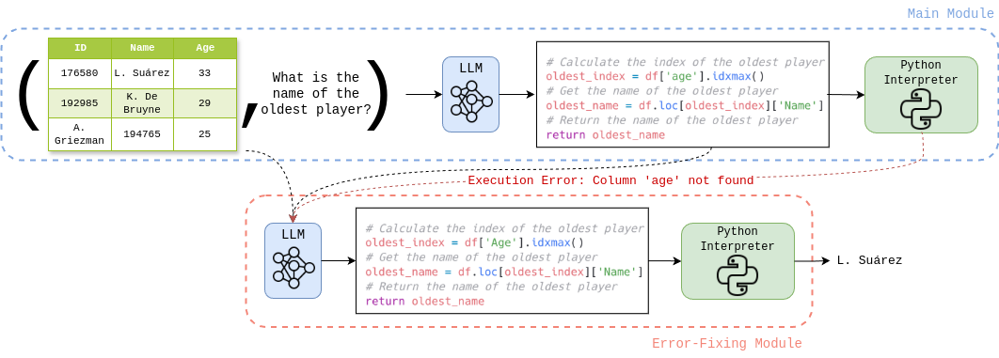

# tabularqa

This repo includes the system developed for SemEval 2025 Task 8: Question Answering Over Tabular Data by AILS-NTUA.

The system ranked 1st in the proprietary models ranking in both subtasks of the competition.

The system description paper will be published in ACL 2025. The preprint is available at [arXiv](https://arxiv.org/abs/2503.00435).

## Architecture

The system performs Text-to-Python Code conversion of user queries through prompting Large Language Models (LLMs). More details on the architecture can be found in the paper.
